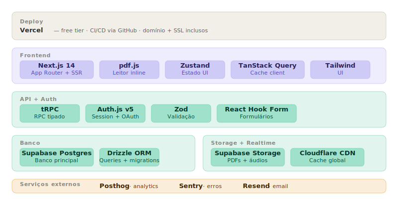
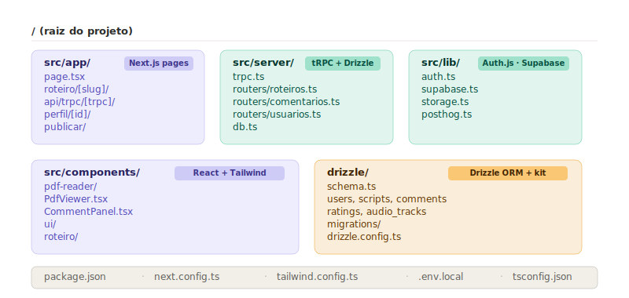
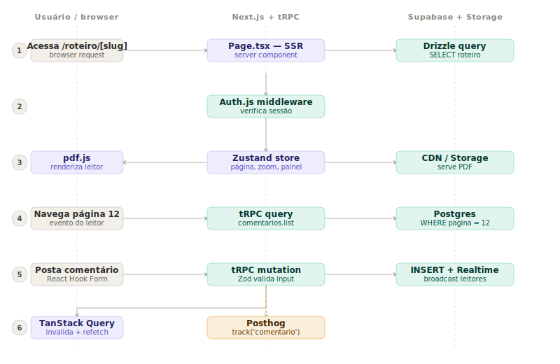

# ADR-001 — Arquitetura da plataforma Antes da Tela

| Campo         | Valor                        |
| ------------- | ---------------------------- |
| **Status**    | Aceito                       |
| **Data**      | 11/06/2024                   |
| **Contexto**  | POC — validação de hipóteses |
| **Decisores** | Plaza Creative Collective    |

---

## Contexto

Plataforma de publicação, leitura e discussão de roteiros audiovisuais. O objetivo imediato é uma POC para validar três hipóteses: consumo de roteiros, demanda por feedback estruturado e valor de curadoria.

A stack deve minimizar custo operacional, maximizar velocidade de entrega e evitar lock-in desnecessário.

Restrições:

- Time pequeno, sem DevOps dedicado
- Volume inicial desconhecido — free tiers suficientes para POC
- Feature crítica: leitor de PDF com comentários por página
- Realtime necessário para comentários ao vivo
- Preferência por TypeScript end-to-end

---

## Stack decidida

```
Repositório → Único (single repo Next.js)
Deploy      → Vercel (free tier)
Frontend    → Next.js 14 App Router
API         → tRPC + Zod
Auth        → Supabase Auth (@supabase/ssr)
ORM         → Drizzle
Banco       → Supabase Postgres
Storage     → Supabase Storage + Cloudflare CDN
Cache       → TanStack Query
Estado UI   → Zustand
Leitor PDF  → pdf.js
Analytics   → Posthog
Erros       → Sentry (free tier)
Email       → Resend (free tier)
```

---



---

## Decisões e alternativas consideradas

### Estrutura de repositório — Single repo

**Escolha:** Repositório único, sem monorepo
**Rejeitados:** Monorepo com Turborepo ou Nx
**Motivo:** O backend é inteiramente Supabase — não existe serviço Node.js separado para hospedar. Os routers tRPC vivem dentro do próprio Next.js em `/src/server/`. Schema Drizzle e configuração do Supabase Auth são arquivos locais do mesmo projeto. Não há pacotes para compartilhar entre apps distintos. Monorepo adicionaria complexidade de tooling sem benefício concreto na POC.

Estrutura de pastas:

```
/
├── src/
│   ├── app/          # Next.js App Router — páginas e API routes
│   ├── server/       # tRPC routers e Drizzle queries
│   ├── lib/          # Supabase client, Supabase Auth config
│   └── components/   # Componentes React e UI
├── drizzle/          # Schema e migrations
└── package.json
```



> Monorepo passa a fazer sentido se surgir app mobile, SDK público ou serviço backend separado — nenhum desses casos se aplica à POC.

---

### Deploy — Vercel

**Escolha:** Vercel free tier
**Rejeitados:** Fly.io, Railway
**Motivo:** CI/CD zero-config via GitHub. Domínio e SSL inclusos. Colocação com Next.js elimina configuração de infra.

---

### Framework — Next.js 14 App Router

**Escolha:** Next.js 14 com App Router
**Rejeitados:** Remix, Vite SPA
**Motivo:** SSR nativo para SEO das páginas de roteiro. App Router permite server components para fetch de dados sem waterfall no cliente.

---

### API — tRPC

**Escolha:** tRPC
**Rejeitados:** REST, GraphQL, Hono
**Motivo:** Tipagem end-to-end sem geração de código. Sem schema manual. O tipo do router vira automaticamente o tipo do cliente. Ideal para monorepo Next.js onde front e back compartilham o mesmo repositório.

> Hono faz mais sentido se houver necessidade de API pública consumida por terceiros — não é o caso na POC.

---

### Auth — Supabase Auth (@supabase/ssr)

**Escolha:** Supabase Auth (@supabase/ssr)
**Rejeitados:** Auth.js (NextAuth), Clerk, Lucia, Better Auth
**Motivo:** Já faz parte da infraestrutura do Supabase utilizada no projeto. Evita uma camada redundante de autenticação, reduz latência e simplifica a gestão de usuários e permissões (RLS) diretamente no Postgres. Suporta SSR nativamente através do pacote oficial `@supabase/ssr`.

---

### ORM — Drizzle

**Escolha:** Drizzle ORM
**Rejeitados:** Prisma, Kysely
**Motivo:** Bundle mínimo, sem binário Rust, compatível com edge functions. Queries SQL-like com tipagem total. Prisma gera cold start lento em ambiente serverless Vercel.

---

### Banco — Supabase Postgres

**Escolha:** Supabase Postgres
**Rejeitados:** Firebase Firestore, PocketBase, Neon
**Motivo:** Postgres real (relacional). Auth, Storage e Realtime nativos no mesmo projeto e painel. Free tier de 500 MB e 2 projetos ativos. Lock-in baixo — banco é Postgres padrão, migrável para qualquer provedor.

---

### Validação — Zod + React Hook Form

**Escolha:** Zod + React Hook Form
**Rejeitados:** Valibot, Yup
**Motivo:** Padrão do ecossistema tRPC. Schema Zod reutilizado entre validação de API e formulários via `zodResolver`. Valibot tem bundle menor mas ecossistema ainda menor.

---

### Cache client — TanStack Query

**Escolha:** TanStack Query
**Rejeitados:** SWR, Context API
**Motivo:** Integração nativa com tRPC via `@trpc/react-query`. Invalidação automática após mutations, loading states e refetch em foco saem de graça.

---

### Estado UI — Zustand

**Escolha:** Zustand
**Rejeitados:** Redux Toolkit, Jotai, Context API
**Motivo:** ~1 kB, boilerplate mínimo. Adequado para estado local do leitor de PDF (página atual, zoom, painel de comentários aberto/fechado).

---

### Leitor de PDF — pdf.js

**Escolha:** pdf.js
**Rejeitados:** iframe embed, react-pdf
**Motivo:** Renderização no browser sem proxy de servidor. Acesso programático a metadados de página necessário para ancoragem de comentários por página — o diferencial central da plataforma.

---

### Storage — Supabase Storage + Cloudflare CDN

**Escolha:** Supabase Storage com Cloudflare como CDN
**Rejeitados:** AWS S3, Cloudflare R2
**Motivo:** Supabase Storage integrado ao mesmo projeto — zero configuração adicional. Cloudflare proxy de cache para PDFs e áudios pesados com entrega global.

---

### Observabilidade

| Serviço | Função                                               | Alternativa rejeitada      |
| ------- | ---------------------------------------------------- | -------------------------- |
| Posthog | Analytics de comportamento, heatmap de páginas lidas | Google Analytics, Mixpanel |
| Sentry  | Captura de erros em produção                         | Datadog (pago)             |
| Resend  | Emails transacionais                                 | SendGrid, AWS SES          |

---

## Fluxo de requisição



---

## Consequências

### Positivas

- Custo zero na POC — todos os serviços operam no free tier
- TypeScript end-to-end — erros de contrato detectados em compile time
- Repositório único reduz overhead de tooling e configuração
- Supabase concentra banco, auth, storage e realtime — reduz superfície operacional
- Drizzle elimina cold start lento do Prisma em ambiente serverless
- Lock-in baixo — Postgres padrão, migrável para Neon, RDS ou self-hosted

### Riscos e limitações

- Supabase free tier pausa projetos inativos após 1 semana sem acesso
- tRPC não serve bem APIs públicas consumidas por terceiros
- Supabase Auth requer configuração cuidadosa de middleware para persistência de sessão em SSR
- pdf.js exige atenção a performance em roteiros longos (> 120 páginas)
- Vercel free tier limita execução de funções a 10s por request

---

## Fora do escopo desta versão

- Busca full-text avançada (Supabase FTS disponível, ativado pós-POC)
- Envio para festivais e concursos externos
- Marketplace de roteiros com sistema de pagamento
- App mobile nativo
- Avaliação profissional paga

---

## Critério de revisão

Esta ADR deve ser revisada se:

- o volume de usuários ultrapassar os limites do free tier do Supabase
- surgir necessidade de API pública para consumo externo por terceiros
- a POC validar crescimento que justifique separar serviços em provedores especializados
