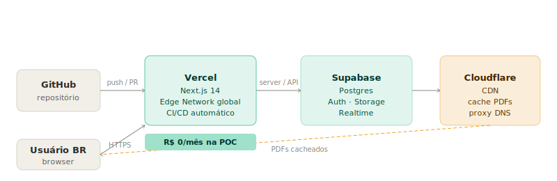
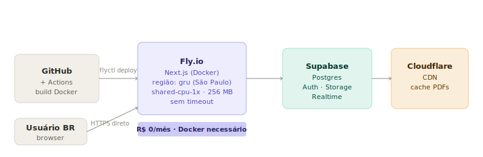
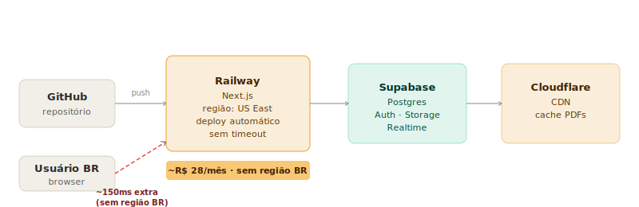

# RFC-002 — Infraestrutura e deploy — Antes da Tela

| Campo           | Valor                                                                                 |
| --------------- | ------------------------------------------------------------------------------------- |
| **Tipo**        | RFC — Request for Comments                                                            |
| **Status**      | **Aberto — aguardando decisão**                                                       |
| **Data**        | 11/04/2026                                                                            |
| **Autor**       | Plaza Creative Collective                                                             |
| **Relacionado** | [ADR-001 — Arquitetura da plataforma Antes da Tela](../adrs/ADR-001-antes-da-tela.md) |

---

## Objetivo

Definir onde e como a plataforma será hospedada, considerando custo, complexidade operacional e capacidade de escala. Este documento apresenta três cenários de infra viáveis para a POC e solicita uma decisão do time.

---

## Restrições conhecidas

- Sem DevOps dedicado — a infra deve ser gerenciada pelo time de desenvolvimento
- Orçamento inicial próximo de zero — preferência por free tiers
- Stack definida: Next.js 14 + Supabase + Cloudflare CDN (ADR-001)
- PDFs de até ~20 MB por roteiro
- Realtime via Supabase (WebSocket) — requer conexão persistente no cliente, não no servidor
- Estimativa inicial: < 500 usuários nos primeiros 3 meses

---

## Componentes a hospedar

| Componente          | O que é                    | Requisito                    |
| ------------------- | -------------------------- | ---------------------------- |
| App web (Next.js)   | Frontend + API routes tRPC | Deploy Node.js / edge        |
| Banco de dados      | Supabase Postgres          | Gerenciado pelo Supabase     |
| Storage de arquivos | PDFs e áudios              | Gerenciado pelo Supabase     |
| CDN                 | Cache de PDFs              | Cloudflare (gratuito)        |
| Email               | Transacional               | Resend (gratuito até 3k/mês) |
| Analytics           | Posthog                    | Cloud ou self-hosted         |
| Erros               | Sentry                     | Free tier                    |

> Supabase, Cloudflare, Resend, Posthog e Sentry são serviços gerenciados externos — independem da escolha de infra do app Next.js. A decisão abaixo se refere **apenas ao deploy do app Next.js**.

---

## Opções de infra para o app Next.js

---

### Opção A — Vercel (recomendada para POC)

Deploy gerenciado, otimizado para Next.js. Zero configuração.

#### Planos e limites

| Recurso             | Hobby (gratuito) | Pro (U$20/mês)    |
| ------------------- | ---------------- | ----------------- |
| Projetos            | ilimitados       | ilimitados        |
| Bandwidth           | 100 GB/mês       | 1 TB/mês          |
| Execução de funções | 100 GB-hora/mês  | 1.000 GB-hora/mês |
| Timeout de função   | 10s              | 60s               |
| Domínio customizado | sim              | sim               |
| CI/CD via GitHub    | sim              | sim               |
| Analytics           | básico           | avançado          |
| Suporte             | comunidade       | e-mail            |
| Membros do time     | 1                | ilimitados        |

#### Custo estimado por fase

| Fase                          | Plano        | Custo/mês      |
| ----------------------------- | ------------ | -------------- |
| POC (< 500 usuários)          | Hobby        | **R$ 0**       |
| Crescimento (500–5k usuários) | Hobby ou Pro | **R$ 0–110**   |
| Escala (5k–50k usuários)      | Pro          | **R$ 110–500** |

#### Prós

- Zero configuração — push no GitHub faz deploy
- Preview deployments automáticos por PR
- Edge network global — baixa latência no Brasil
- Rollback instantâneo
- SSL e domínio inclusos
- Suporte nativo a App Router, Middleware e ISR

#### Contras

- Vendor lock-in alto — features como Middleware e ISR dependem da Vercel
- Hobby plan limita a 1 membro — time precisa compartilhar conta ou migrar para Pro
- Timeout de 10s no Hobby pode ser problema em uploads grandes
- Custo escala rapidamente acima de 50k usuários

#### Quando migrar

Migrar para Pro quando: time crescer além de 1 pessoa, ou uploads de PDF causarem timeouts frequentes.

---

### Opção B — Fly.io

Deploy de containers Docker, com controle maior de infra. Free tier generoso para apps pequenos.

#### Planos e limites

| Recurso         | Free                   | Pay-as-you-go         |
| --------------- | ---------------------- | --------------------- |
| Máquinas (VMs)  | 3 shared-cpu-1x 256 MB | qualquer tamanho      |
| Bandwidth       | 160 GB/mês             | U$0,02/GB excedente   |
| Regiões         | global                 | global                |
| Volumes (disco) | 3 GB                   | U$0,15/GB/mês         |
| IPs dedicados   | 1 IPv4 compartilhado   | U$2/mês IPv4 dedicado |
| SSL             | sim                    | sim                   |
| CI/CD           | manual (flyctl)        | manual (flyctl)       |

#### Custo estimado por fase

| Fase        | Config                    | Custo/mês   |
| ----------- | ------------------------- | ----------- |
| POC         | 1 VM shared-cpu-1x 256 MB | **R$ 0**    |
| Crescimento | 1 VM shared-cpu-1x 512 MB | **~R$ 30**  |
| Escala      | 2 VMs shared-cpu-2x 1 GB  | **~R$ 120** |

#### Prós

- Controle total sobre o container — sem surpresas de comportamento
- Sem timeout arbitrário de função
- Suporte a WebSockets nativos (útil se Realtime migrar para fora do Supabase)
- Pay-as-you-go — custo proporcional ao uso real
- Deploy em São Paulo (região `gru`) — latência mínima para Brasil

#### Contras

- Requer Dockerfile e configuração manual de CI/CD
- Next.js não é cidadão de primeira classe — features como ISR e Middleware precisam de adaptação
- Sem preview deployments automáticos
- Operação mais complexa que Vercel para um time sem DevOps

#### Quando escolher

Fly.io faz mais sentido se o time tiver experiência com Docker e quiser controle de custo granular desde o início, ou se houver necessidade de WebSockets persistentes no servidor.

---

### Opção C — Railway

Meio-termo entre Vercel e Fly.io. Deploy automático via GitHub com controle maior que Vercel.

#### Planos e limites

| Recurso             | Hobby (U$5/mês)        | Pro (U$20/mês)          |
| ------------------- | ---------------------- | ----------------------- |
| Execução            | U$5 de crédito incluso | U$20 de crédito incluso |
| Projetos            | ilimitados             | ilimitados              |
| Membros             | ilimitados             | ilimitados              |
| Domínio customizado | sim                    | sim                     |
| Tempo de execução   | ilimitado              | ilimitado               |
| Regiões             | US, EU                 | US, EU, Asia            |
| Sem região Brasil   | —                      | —                       |

> Railway não tem região no Brasil. Todo tráfego roteia pelos EUA — adiciona ~150ms de latência para usuários brasileiros.

#### Custo estimado por fase

| Fase        | Config | Custo/mês              |
| ----------- | ------ | ---------------------- |
| POC         | Hobby  | **U$5 (~R$ 28)**       |
| Crescimento | Hobby  | **U$5–15 (~R$ 28–85)** |
| Escala      | Pro    | **U$20+ (~R$ 112+)**   |

#### Prós

- Deploy automático via GitHub (similar ao Vercel)
- Sem timeout de função
- Suporte nativo a Next.js — menos configuração que Fly.io
- Membros ilimitados no Hobby

#### Contras

- Sem free tier real — mínimo de U$5/mês
- Sem região no Brasil — latência maior para o público-alvo
- Ecossistema menor que Vercel
- Preview deployments não são automáticos

#### Quando escolher

Railway faz sentido se o time quiser mais de 1 membro sem pagar U$20/mês (Vercel Pro) e aceitar a latência adicional. Para uma plataforma com público 100% brasileiro, a ausência de região local é uma desvantagem significativa.

---

## Comparativo direto

| Critério                | Vercel Hobby | Fly.io Free   | Railway Hobby |
| ----------------------- | ------------ | ------------- | ------------- |
| **Custo inicial**       | R$ 0         | R$ 0          | ~R$ 28/mês    |
| **Custo a 5k usuários** | R$ 0–110     | ~R$ 30        | ~R$ 60        |
| **Configuração**        | zero         | alta (Docker) | baixa         |
| **Next.js suporte**     | nativo       | manual        | bom           |
| **Região Brasil**       | sim (edge)   | sim (gru)     | não           |
| **Timeout**             | 10s (Hobby)  | sem limite    | sem limite    |
| **Membros no free**     | 1            | ilimitados    | ilimitados    |
| **Preview por PR**      | sim          | não           | não           |
| **Lock-in**             | alto         | baixo         | médio         |
| **Complexidade ops**    | mínima       | alta          | baixa         |

---

## Recomendação

Para a POC, **Opção A (Vercel Hobby)** é a escolha com menor fricção:

- Deploy em minutos, sem configuração
- R$ 0 até validar as hipóteses
- Preview deployments facilitam revisão de features
- Migração para Pro ou Fly.io é viável quando o produto validar crescimento

O único risco relevante no Hobby é o **limite de 1 membro**. Se o time já tiver 2+ pessoas, iniciar direto no Pro (U$20/mês) ou usar Fly.io elimina esse problema.

---

## Decisão solicitada

> **Qual opção de infra o time aprova para o deploy inicial?**
>
> - [ ] **A — Vercel Hobby** (R$ 0, 1 membro, ideal para POC solo)
> - [ ] **A — Vercel Pro** (U$20/mês, membros ilimitados, ideal para time)
> - [ ] **B — Fly.io** (R$ 0, controle maior, requer Docker)
> - [ ] **C — Railway** (~R$ 28/mês, sem região Brasil)

Marque a opção escolhida e atualize o status deste RFC para `aceito`. Crie a ADR-002 referenciando este documento.

---

## Próximos passos após decisão

1. Criar conta e conectar repositório GitHub
2. Configurar variáveis de ambiente (`.env.production`)
3. Configurar domínio customizado
4. Configurar Cloudflare como proxy DNS
5. Criar ADR-002 documentando a decisão

---

## Referências

- [Vercel pricing](https://vercel.com/pricing)
- [Fly.io pricing](https://fly.io/docs/about/pricing/)
- [Railway pricing](https://railway.app/pricing)
- [ADR-001 — Arquitetura da plataforma Antes da Tela](./ADR-001-arquitetura.md)
